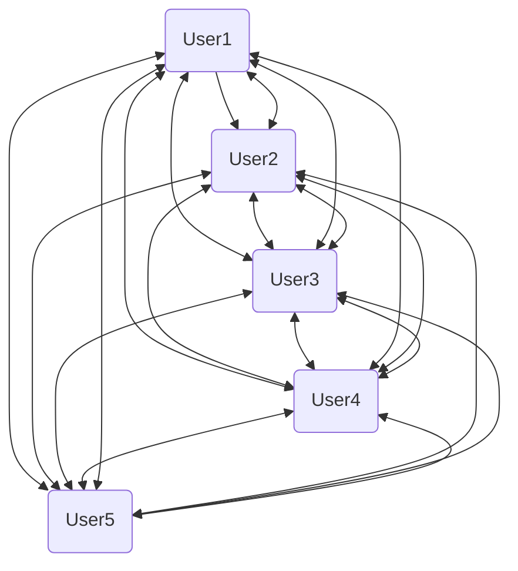

  

# BeeMail 2.0

Welcome to BeeMail 2.0, the buzziest messaging service in the world!

Why 2.0, I hear you ask? Well, read on dear developer...

## Background

When we built 1.0, we only had a `User` class. Users sent messages _directly_ to
each other. It worked and seemed like the simplest solution but, erm... just look at this dependency nightmare.

Every user needed to have access to a list of all other users. This creates a situation where every user object is tightly coupled to every other user object. Any change to how a user sends or receives a message or if a new user is added it forces changes across all users.

We need a different approach, introducing a central hub to manage all communication. That's why we're building the new `App` class!

## Goals: Singleton and Mediator

The overall goal of BeeMail 2.0 is to implement two core design patterns:

### 1. The Singleton Pattern

This pattern ensures that a class has only **one** instance throughout the application and provides a global point of access to it.

The `App` class must be implemented as a Singleton. This is necessary because the `App` represents the single, central messaging service that all users log into and communicate through. There can only be one BeeMail service running.

### 2. The Mediator Pattern

This pattern aims to reduce chaotic dependencies between objects by restricting their direct communications and making them only communicate through a dedicated mediator object.

The `App` class will also act as the Mediator. It coordinates message delivery between `User` objects.

This pattern decouples the `User` objects, ensuring that no `User` talks directly to another `User`; all communication must go via the central mediator `App`.

## Getting started

This project can be completed in any language that supports classes.

To get started:

1. Create a project in your language's project framework

2. Read through the [project requirements](/TODO.md) - it's up to you how to
   implement them, but make sure you follow the design pattern guidance.

---
